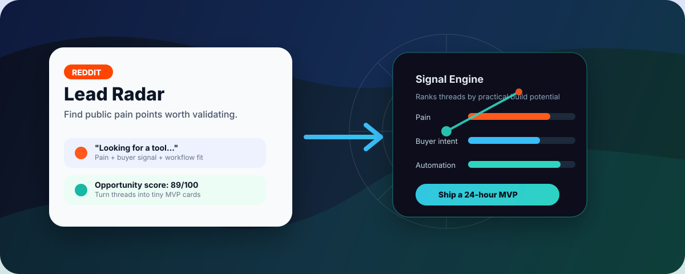

# Reddit Lead Radar

[中文说明](README.zh-CN.md)



A local-first Reddit pain-point research CLI for indie hackers.

It scans public Reddit JSON endpoints, ranks posts by practical opportunity signals, and turns the best threads into small automation project cards you can validate quickly.

This is a demand research tool, not a spam tool. It is designed to help you understand public pain points and build useful tiny products.

## What It Finds

The radar looks for posts with signals like:

- pain: "manual", "takes too long", "looking for a tool", "can't find"
- buyer intent: "client", "customer", "budget", "Shopify", "business"
- urgency: "today", "this week", "ASAP", "deadline"
- automation fit: "workflow", "CSV", "CRM", "email", "Zapier", "dashboard"
- engagement: score and comments

Each result becomes an opportunity card with:

- target user
- pain point
- MVP idea
- suggested GitHub project name
- first 24-hour build
- possible monetization path

## Install

```bash
git clone https://github.com/YOUR_USER/reddit-lead-radar.git
cd reddit-lead-radar
python -m pip install -e .
```

No Reddit API key is required for the basic public JSON mode.
Depending on your network, Reddit may still return 403 or rate-limit public JSON requests. The CLI will skip blocked searches and keep writing whatever it can collect. For heavier usage, use Reddit's official API and keep the same analysis/report layer.

## Quick Start

Run a local sample:

```bash
python -m reddit_lead_radar.cli analyze examples/sample_posts.json --out reports/sample.md --json-out reports/sample.json
```

Run tests with the Python standard library:

```bash
python -m unittest discover -s tests
```

Scan Reddit:

```bash
reddit-lead-radar scan \
  --subreddits SideProject,SaaS,nocode,automation \
  --keywords "looking for tool,need a tool,manual workflow,shopify automation" \
  --limit 10 \
  --days 30 \
  --comments 3 \
  --out reports/latest.md \
  --json-out reports/latest.json
```

On Windows PowerShell:

```powershell
reddit-lead-radar scan --subreddits SideProject,SaaS,nocode,automation --keywords "looking for tool,need a tool,manual workflow,shopify automation" --limit 10 --days 30 --comments 3 --out reports/latest.md --json-out reports/latest.json
```

## Example Output

See [examples/sample_report.md](examples/sample_report.md) for a full generated-style report.

```markdown
## 1. Looking for a tool to automate Shopify product page audits

Score: 89/100
Subreddit: r/SideProject

### Opportunity Card

- Target user: Small ecommerce operators and Shopify store owners
- Pain point: Store owners need faster ways to audit listings, pages, copy, and conversion gaps.
- MVP idea: A Shopify store roaster that turns a store URL into a practical conversion checklist.
- GitHub project name: `shopify-store-roaster`
- First build: Fetch one public store page, extract copy and metadata, then generate a Markdown audit.
- Monetization: Paid audits, template packs, or a small monthly monitoring plan.
```

## Responsible Use

Please use this project for research and validation:

- Respect Reddit's rules and rate limits.
- Keep request volume low.
- Do not collect private information.
- Do not generate harassment, spam, or unsolicited outreach.
- Prefer learning from public patterns over targeting individuals.

The default delay is 2 seconds between requests. Increase it if you scan more combinations.

## Roadmap

- Keyword presets for ecommerce, SaaS, local business, and automation agencies
- GitHub Actions daily report mode
- CSV export
- Better comment summarization
- Optional LLM-powered opportunity explanations
